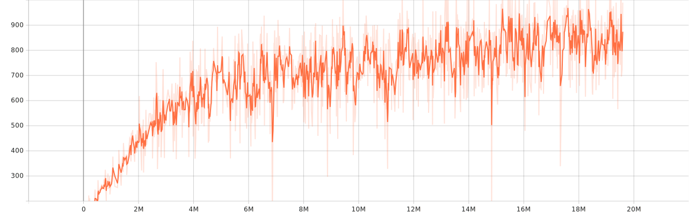

# gym_2048

This is the Gym environment for the 2048 game.

|      Object       |         Describe          |
|:-----------------:|:-------------------------:|
|   Action Space    |        Discrete(4)        |
| Observation Space |        (4, 4, 16)         |
| Observation High  |            255            |
|  Observation Low  |             0             |
|      Import       | `gym.make("2048game-v0")` |

## Description

This is a clone of the game 2048, intended for use in reinforcement learning for agent training, the original 2048 game can be found [here](https://github.com/gabrielecirulli/2048).

The game ends when your agent has made too many invalid moves (an invalid move means that the positions of all the blocks on the board do not change before and after the move, inspired by [here](https://github.com/FelipeMarcelino/2048-Gym)), there are no remaining positions on the board or the max block reaches the 15th power of 2 (32768).

You can move all the blocks in four directions, up, down, left or right, and after each move, a random block will be created in the remaining position, with a number of 2. If there are adjacent blocks with the same number in the direction of the move, the two blocks will be merged into one block, and the new block will be twice the size of the original numbers.

Each time the environment will give a reward when the blocks are merged.

## Action

There are a total of 4 modes of action.

| Number | Represent |
|:------:|:---------:|
|   0    |    Up     |
|   1    |   Down    |
|   2    |   Left    |
|   3    |   Right   |

## Observations

**There is no graphical interface at the moment.**

The observation space is (4, 4, 16). This can be thought of as a 4 by 4 pixels size image with 16 channels (unlike the traditional RGB image which has 3 channels).

The encoding method is similar to one-hot encoding. If there is a block with the number n (n greater than 0), then the 0 channel number is 255, while the log2(n) channel is also 255 and the rest of the channels are 0.

## Rewards

* Merge a new block made of n will give a log2(n) reward.
* When the maximum value of a block is greater than 2048, add 10 to each merge reward, which is 10 + log2(n).
* When the maximum value of a block is the 15th power of 2 (32768), add 1000 of the merge reward, and end the episode.
* When the move is invalid, give the punishment reward of -5.
* When the number of invalid moves is bigger than 16 and also bigger the 0.1 times the total number of steps, add -5 to the punishment reward for the invalid move punishment, and end the episode.
* When there are no positions left on the board and there are no blocks that can potentially be merged, add 1 reward to the step reward, and end the episode.

## How to use

I strongly recommend you use this environment by passing keyword arguments to Gym, such as:
~~~ python
import gym
import gym_2048.envs
env = gym.make("2048game-v0")
~~~
Rather than install it, because I didn't test this part :)

# Simple model

I tested this environment on Deep Q Learning using the [Stable Baselines3](https://github.com/DLR-RM/stable-baselines3) library. I ran approximately 19.6M rounds and the process took me approximately 43 hours, the results are shown below. There is a big difference between two evaluation metrics: Mean episode training length and (Evaluate) Mean episode length which is shown below. It is clear that the agent is still learning and the model has not reached the optimal situation.

About the Custom_CNN.py document is a custom feature extractor, you can check the paper named [Playing game 2048 with deep convolutional neural networks trained by supervised learning](https://www.jstage.jst.go.jp/article/ipsjjip/27/0/27_340/_pdf) to get more information.

I ran 100 tests on the resulting model and achieved 2048 in 10 times, 1024 in 68 times, 512 in 20 times and 256 in 2 times.

You can run check_model.py to test the model, it will print a dict, the key of the dict is the maximum value of the episode, and the value of the dict is the number of episodes that get this value.

## Mean episode training length

The mean episode training length is averaged training length over 100 episodes.

## Mean episodic training reward

The mean episodic training reward is averaged training reward over 100 episodes.

## Exploration rate

The current value of the exploration rate when using DQN (initial value is 1.0), corresponds to the fraction of actions taken randomly (epsilon of the “epsilon-greedy” exploration).

## (Evaluate) Mean episode length

Mean episode length on the testing environment. This and the following indicator are used to measure the performance of the current model.

## (Evaluate) Mean episodic reward

Mean episodic reward (during evaluation)

