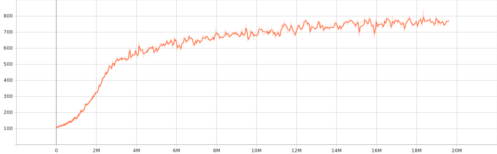
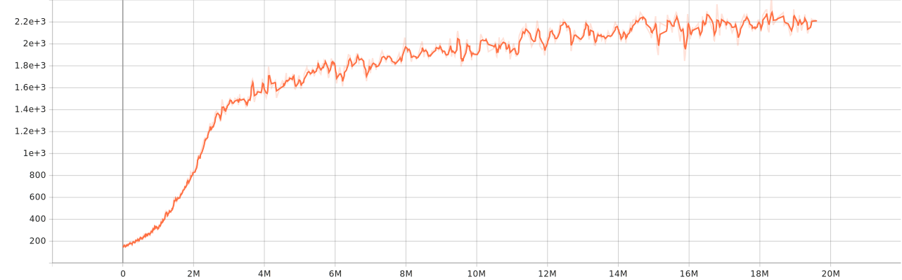
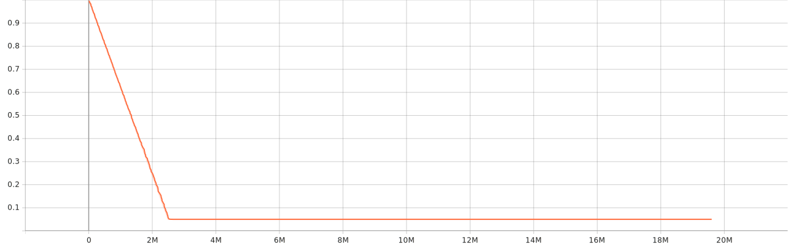

# gym_2048

This is the Gym environment for the 2048 game.

## how to use

I strongly recommend you use this environment by passing keyword arguments to Gym, such as:
~~~ python
import gym
import gym_2048.envs
env = gym.make("2048game-v0")
~~~
Rather than install it, because I didn't test this part :)

## test result 

I test this environment on Deep Q Learning, and the result showing below.

Mean episode length

Mean episodic training reward

Exploration rate (initial is 1.0)

(Evaluate) Mean episode length

(Evaluate) Mean episodic reward

## future work

- Continue to test this environment using more algorithms and rounds.
- Finish the rendering part for this environment.
- Try to use another way to give rewards and find whether it can speed the learning speed.

